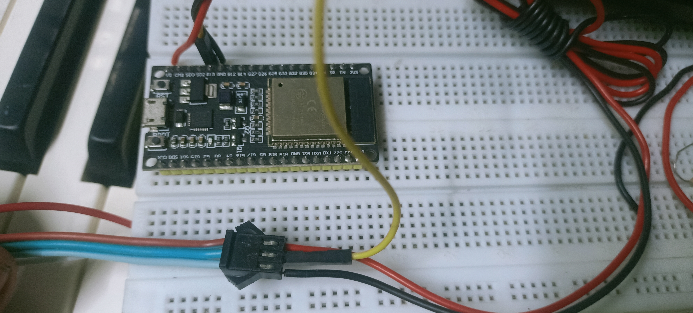
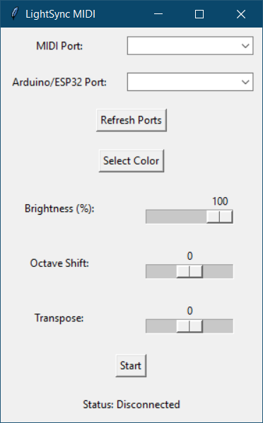
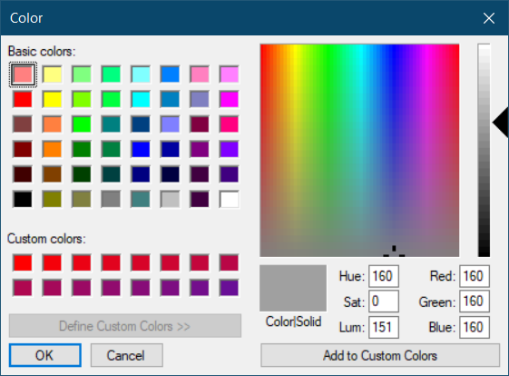
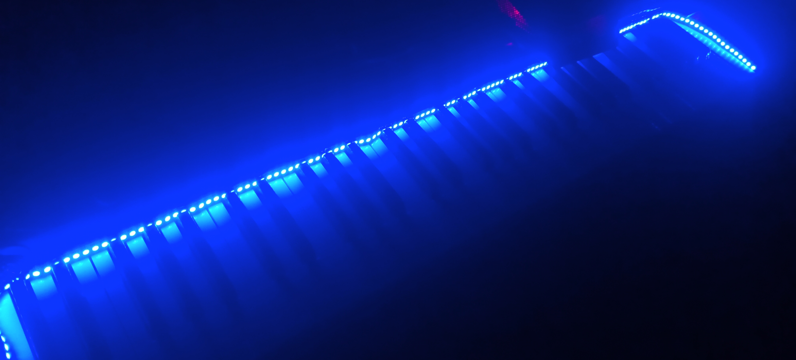
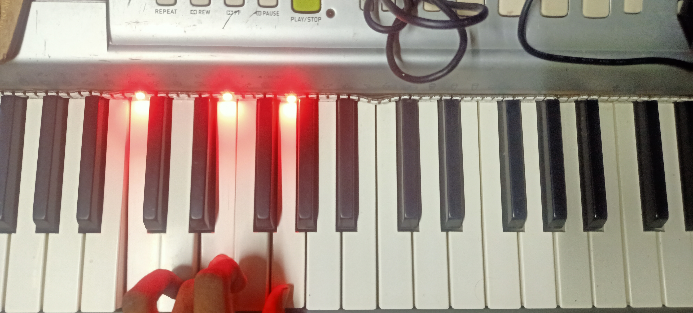
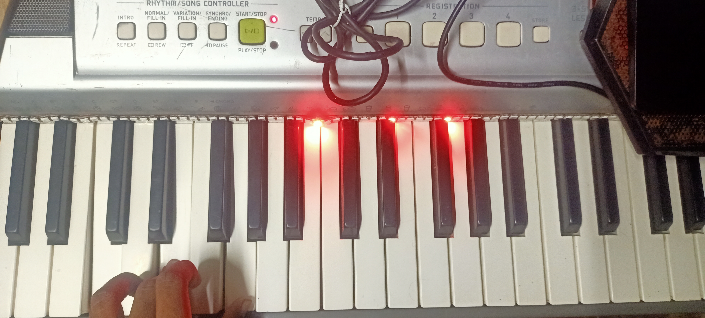

# LightSync MIDI

LightSync MIDI is a customizable MIDI light controller application for WS2812B LED strips, integrated with an ESP32 microcontroller. This project allows synchronization of LED lights with MIDI input from keyboards, offering various effects and configurations.

## Features

- **Customizable LED Effects:** Choose from effects like normal, splash, spark, and flow.
- **Brightness and Color Control:** Adjust LED brightness and select colors via a GUI.
- **Keyboard Mapping:** Customize LED mapping to match different keyboard sizes (61, 76, 88 keys).
- **ESP32 Integration:** Control LED effects wirelessly through an ESP32 microcontroller.
- **User Interface:** Intuitive Python GUI for easy control and setup.

## Setup and Usage

1. **Hardware Requirements:**
   - WS2812B LED strip (144 LEDs/m recommended)
   - ESP32 microcontroller
   - MIDI keyboard

2. **Software Requirements:**
   - Python for GUI interface
   - Arduino IDE for ESP32 firmware

3. **Wiring:**
   - Refer to  for wiring diagram.

4. **Installation:**
   - Clone the repository.
   - Install necessary Python dependencies (`pip install -r requirements.txt`).

5. **Running the Application:**
   - Run `LightSync-MIDI.py` for the Python GUI.
   - Upload `LightSync_MIDI_ESP32.ino` to ESP32 using Arduino IDE.

6. **Media Files:**
   - : Screenshot of the LightSync MIDI application.
   - : Color selector GUI screenshot.
   - : Video demo of live MIDI control.
   - : Image of blue LED glow on startup.
   - : Image of correct LED mapping for keyboard.
   - : Video demo of MIDI keyboard playing music.
   - : Image of incorrect LED mapping for keyboard.

7. **Contributing:**
   - Fork the repository and create a pull request for new features or bug fixes.

8. **License:**
   - This project is licensed under the MIT License. See `LICENSE` for details.

9. **Contact:**
   - For questions or support, reach out to [Yogarathinam](https://github.com/Yogarathinam).
